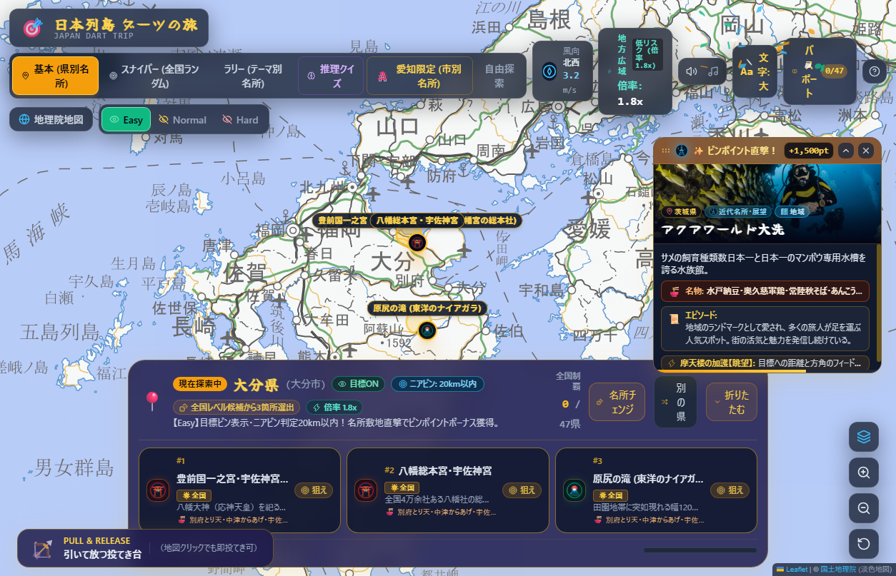
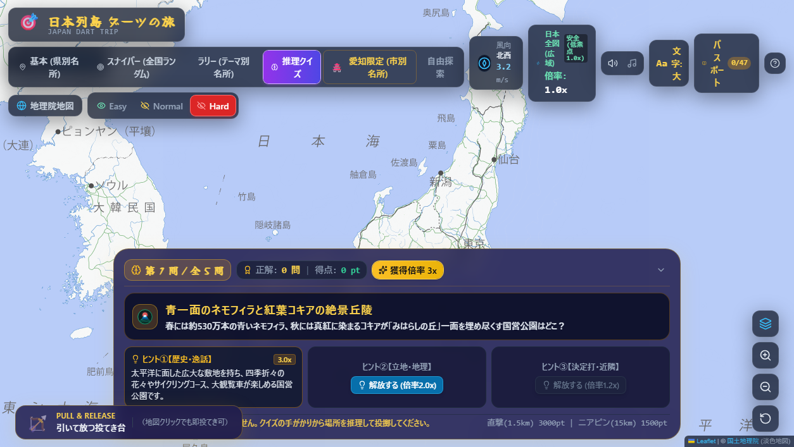
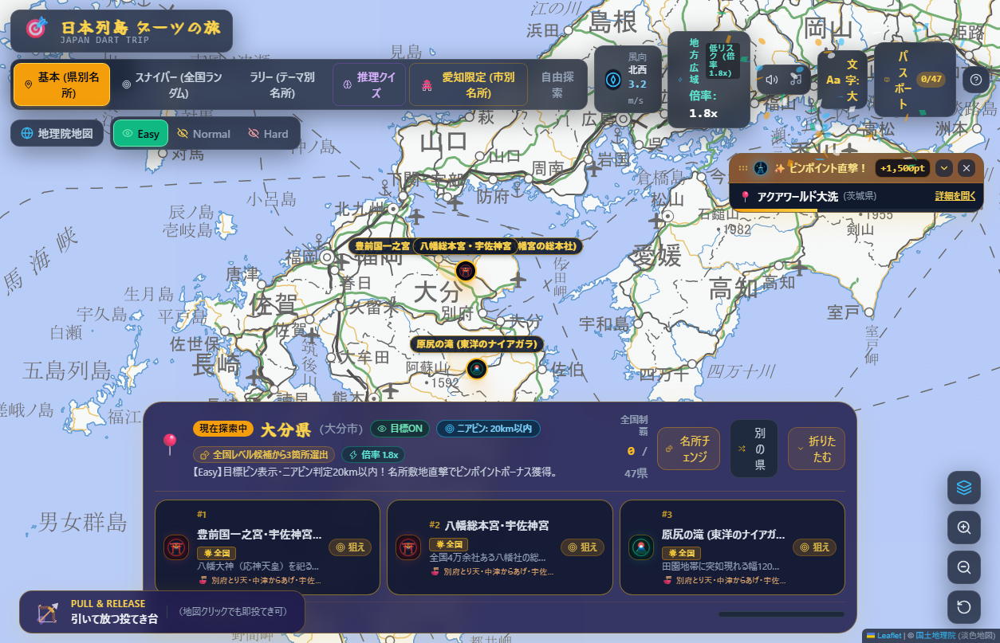
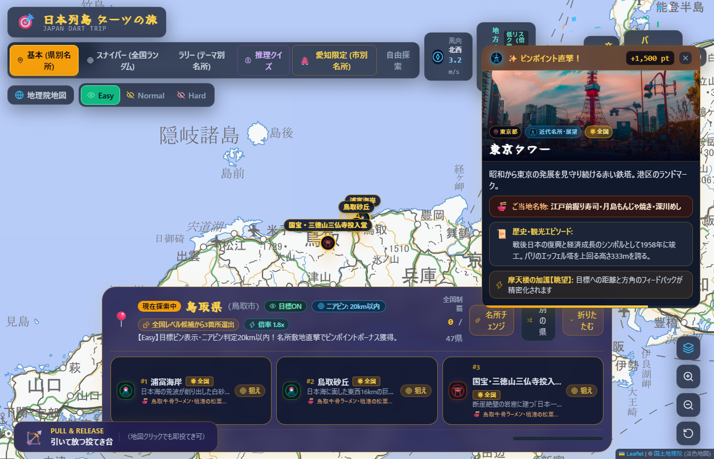

# 🎯 Geo Darts Japan (ジオダーツ 日本列島)

> **全国47都道府県・厳選940箇所の名所を巡る、和風モダン・ブラウザ地理ダーツゲーム**


---

## 📖 プロジェクト概要

『**Geo Darts Japan（ジオダーツ 日本列島）**』は、日本全国47都道府県および**全国940箇所の厳選観光名所・史跡・絶景・名湯・ご当地グルメ**を舞台に、地理知識・精密な狙撃力・風の読みを融合させた和風モダン・ブラウザ地理ゲームです。

国土地理院の公式タイル地図エンジン（Leaflet）と、軽量な和モダン・スタイライズドSVG地図の**デュアルマップエンジン**を搭載。アーケードライクな爽快感と、日本全国を旅しているかのような本格的な教養・観光体験を両立しています。



---

## 📸 サンプル画面 (Screenshots)

### 1. 📍 基本モード（名所ニアピン巡り & スマート命中カード）
HUD操作ボタン（パスポート、音響、フォント拡大等）との重なりを完全回避した配置。高解像度写真、名物グルメ、歴史エピソード、有名度バッジをコンパクトに表示。ヘッダーをつかんで画面上の好きな場所へドラッグ移動も可能です。


### 2. 🧠 ご当地推理クイズモード（全47都道府県網羅・全80問）
地図上に目標ピンが一切表示されず、歴史・地理ヒントを手がかりに日本地図を探索・狙撃。投擲後は正解地点へカメラが自動飛行します。


### 3. ➖ ワンクリック最小化（極小ピル通知モード）
ヘッダー右上のトグルボタンを押すと、高さわずか38pxの極小ピルバーに折りたため、地図上の名所や着弾点を即座に全開確認できます。


### 4. 🗼 名所命中通知カード（東京タワー: 高精細写真・名物グルメ・歴史エピソード）
全国主要名所に配備された美麗な実写観光写真、名物料理タグ、歴史豆知識、旅の加護（属性ボーナス）のスマート表示。


---

## 🌟 主な特徴

### 1. 🗾 全国47都道府県・計940箇所の完全名所マスターデータ
- 各都道府県に厳選された**20箇所**（計940箇所・同名重複完全ゼロ）の名所データを保有。
- すべての名所に「**ご当地名物グルメ（郷土料理）**」「**歴史・観光エピソード（深掘り豆知識）**」「**有名度レベル（3段階）**」を完備。
- 東京タワー、五稜郭、兼六園、姫路城、アクアワールド大洗などの主要名所には実写高解像度写真URLを配備。

### 2. 🌟 有名度3段階難易度連動選出システム
- **🌟 全国レベル (`national`)**: 誰もが知る超有名名所・世界遺産（全国計396箇所）
- **🗺️ 地域レベル (`regional`)**: 地方や県内で定番の観光地・名勝（全国計428箇所）
- **🌿 マイナー・穴場 (`minor`)**: 知る人ぞ知る秘境・隠れた名所（全国計116箇所）
- **難易度別ルール**:
  - **Easy**: 全国レベルのみから3箇所選出（目標表示ON・判定20km以内）
  - **Normal**: 全国 ＋ 地域レベルから3箇所選出（目標非表示・距離方角表示・判定10km以内）
  - **Hard**: 全20箇所すべてから3箇所選出（目標非表示・ヒントなし・判定5km以内）
- **スマートリロール機能**: 「🎲 名所チェンジ」時は直前の名所を自動除外し、常に新鮮な名所を選出。

### 3. 🧠 ご当地推理クイズモード（全47都道府県網羅・計80問）
- 地図上に目標ピンが一切表示されず、出題される歴史・地理ヒントを手がかりに日本地図を探索して着弾させる本格推理モード。
- **3段階ヒント & スコア倍率システム**:
  - ヒント①【歴史・構造・逸話】: 獲得スコア **3.0x**
  - ヒント②【立地・地理・交通】: 獲得スコア **2.0x**
  - ヒント③【決定打・近隣スポット】: 獲得スコア **1.2x**
- 投擲後は正解地の緯度経度へ**カメラが自動飛行（`flyToLatLng`）**し、詳細解説画面を表示。成績に応じた4大称号（「🗾 日本地理神」〜「🌱 見習い旅人」）を授与。

### 4. 🏯 愛知県詳細限定版（全38市・計114名所）
- 愛知県全38市（尾張・名古屋、知多、西三河、東三河）を完全網羅。各市に3名所（計114名所）を収録。
- 市を選択すると推奨ズームレベル（Zoom 11〜13）へ自動飛行。3名所制覇で「金鯱（しゃちほこ）」祝賀演出。

### 5. 🎨 視界を妨げないスマートなUI/UX
- **HUD重なり完全回避**: 命中通知カードはHUD操作ボタン（パスポート、音響、フォント調整等）から十分に離れた位置に配置。
- **約40%コンパクト化**: 高さを抑え、地図の広い視界を確保。
- **➖ 最小化 / ➕ 展開トグル**: ワンクリックで高さ38pxの極小ピル通知（「📍 名所名 詳細を開く」）に折りたたみ可能。
- **ドラッグ移動対応 (Draggable)**: ヘッダーをつかんで画面上の好きな場所へ自由に移動。
- **ホバー一時停止タイマー**: マウスを乗せている間は自動消去タイマーが一時停止し、じっくり読了可能。次の投擲開始で即座に自動クローズ。
- **フォントサイズ上限300%スケーリング**: `Ctrl + マウスホイール` または HUDボタンで拡大縮小可能。

### 6. 🔊 Web Audio API による動的音響シンセシス
- 外部音声ファイル不要の純粋コード波形シンセサイズ。
- ホワイトノイズ風切り音、打撃着弾音、ピンポイント直撃ファンファーレ、都節音階（ペンタトニック）による和風琴BGMをリアルタイム生成。

---

## 🎮 ゲームモード一覧

| モード名 | 概要 | 判定・ルール |
| :--- | :--- | :--- |
| **📍 基本モード (県別名所めぐり)** | 各県20候補から難易度連動で3箇所選出。全47都道府県制覇を目指す | 難易度別ニアピン判定 (20km/10km/5km) |
| **🧠 ご当地推理クイズ** | 全47都道府県網羅・全80問。ヒントを頼りに正解地点を推理して狙撃 | 3段階ヒント (3.0x/2.0x/1.2x)・自動カメラ飛行 |
| **🎯 スナイパーモード** | 全国940名所からランダムに1箇所指定。10投制限でハイスコア挑戦 | 連続コンボ倍率・歴代ハイスコア記録 |
| **🏎️ ラリーモード** | 新幹線・世界遺産・名湯・グルメなど8大テーマコースを順番に走破 | チェックポイント走破・完走トロフィー |
| **🏯 愛知県詳細限定版** | 愛知県全38市×各3名所（計114名所）の地域深掘り特化モード | 市街地ズーム・市制覇金鯱演出 |
| **🧭 自由探索モード** | 日本全国の任意地点へフリー投擲。都道府県トリビアや特産品を閲覧 | 制約なしフリープレイ |

---

## 🛠️ 技術スタック

| 分類 | 技術・ライブラリ | 用途 |
| :--- | :--- | :--- |
| **UIフレームワーク** | React 19.3 | 関数コンポーネント, フックス, StrictMode |
| **開発言語** | TypeScript 6.0 | 厳格な静的型付けによる完全な型安全性 |
| **ビルドツール** | Vite 8.3 / Rolldown | 高速HMR, 最適化バンドル |
| **CSS・デザイン** | Tailwind CSS 3.4 | 和モダン・グラスモーフィズム, アニメーション |
| **アイコン** | Lucide React 1.47 | ベクターアイコン |
| **地図エンジン** | Leaflet 1.9 | 国土地理院標準・淡色地図タイル連動, スムーズ移動 |
| **祝賀演出** | Canvas-Confetti 1.9 | 紙吹雪パーティクルエフェクト |
| **音響** | Web Audio API | 動的波形合成（風切り音・着弾音・和風琴BGM） |
| **データ永続化** | LocalStorage + 暗号署名 | 改ざん検知チェックサム付きエンベロープ保存 |

---

## 🚀 インストール & 起動手順

### 必要環境
- **Node.js**: v18.0 以上（推奨: v20 以上）
- **npm**: v9.0 以上

### 手順

```bash
# 1. リポジトリのクローン
git clone https://github.com/tooktwick/geo-darts.git
cd geo-darts

# 2. 依存関係のインストール
npm install

# 3. 開発サーバーの起動
npm run dev
# ➜ ブラウザで http://localhost:5173/ を開きます

# 4. 本番用ビルド & 型チェック
npm run build

# 5. ビルド成果物のプレビュー
npm run preview
```

---

## 📁 ディレクトリ構成

```text
geo-darts/
├── docs/
│   └── SYSTEM_SPECIFICATION.md    # システム詳細仕様書 (v1.4.0)
├── public/
│   └── assets/
│       ├── categories/            # 名所種類別高品質画像 (category_*.jpg)
│       └── icons/                 # 和モダンベクターSVGアイコン (cat_*.svg)
├── scratch/                       # データ整合性・E2E実機テストスクリプト群
├── src/
│   ├── components/                # UIコンポーネント群
│   │   ├── BasicTourMissionBar.tsx # 基本モードミッションバー (20候補3選・リロール)
│   │   ├── CategoryIcon.tsx       # 種類別オリジナルベクターSVGアイコン
│   │   ├── DartOverlay.tsx        # ダーツ放物線弾道 & 着弾エフェクト
│   │   ├── GameHUD.tsx            # 上部ヘッダー (風向・風速・難易度・文字サイズ)
│   │   ├── GsiJapanMap.tsx        # 国土地理院マップエンジン (Leaflet)
│   │   ├── JapanMap.tsx           # 和風スタイライズドSVGマップエンジン
│   │   ├── LandmarkHitModal.tsx   # ニアピン命中通知カード (コンパクト・最小化・ドラッグ)
│   │   ├── PassportModal.tsx      # 御朱印帳風パスポート・実績手帳モーダル
│   │   ├── PrefectureModal.tsx    # 都道府県詳細モーダル (全20名所・名物グルメ一覧)
│   │   ├── QuizMissionBar.tsx     # クイズ出題・3段階ヒント・倍率パネル
│   │   ├── QuizResultModal.tsx    # クイズ正解地カメラ飛行 & 詳細解説モーダル
│   │   ├── QuizGameOverModal.tsx  # クイズ総合リザルト & 4大称号授与モーダル
│   │   └── ...                    # 各種モード・クリアモーダル群
│   ├── data/
│   │   ├── aichiData.ts           # 愛知県全38市マスター (計114名所)
│   │   ├── landmarksData.ts       # 全国940名所マスター (47都道府県×各20箇所)
│   │   ├── prefectures.ts         # 47都道府県マスターデータ
│   │   └── quizData.ts            # 全47都道府県網羅・全80問推理クイズマスター
│   ├── utils/
│   │   ├── audio.ts               # Web Audio API 音響シンセサイザー & 和風琴BGM
│   │   ├── geo.ts                 # 球面三角法 (Haversine) 距離・方位角計算
│   │   ├── landmarkImages.ts      # 主要名所高解像度写真マッピング & フォールバック
│   │   └── storage.ts             # LocalStorage暗号署名改ざん防御保存
│   ├── App.tsx                    # メインオーケストレーター
│   └── types.ts                   # 全システム共通TypeScript型定義
├── package.json
├── tailwind.config.js
└── vite.config.ts
```

---

## 📄 ドキュメント & 仕様書

より詳細なアーキテクチャ設計、数学的物理演算（風力・ズーム変位式）、セキュリティ暗号署名仕様、品質保証テスト内容については、以下をご参照ください。

- [システム仕様書 (SYSTEM_SPECIFICATION.md)](./docs/SYSTEM_SPECIFICATION.md)

---

## 🤖 開発について (Built with Google Antigravity)

本プロジェクトは、**Google DeepMind** が開発する次世代エージェント型AIコーディング環境「**Google Antigravity**」を活用して開発されました。

- **ペアプログラミング & 自律エージェント協調**:
  - 人間とAIエージェントの緊密な対話型ペアプログラミングに加え、ゲームプランナー（企画役）、事業開発（営業役）、マーケティング（販売役）の**専門特化サブエージェント群による多角的分析・評価**を統合。
- **自律的データ拡充 & 高精度テスト**:
  - 全国47都道府県・940箇所の完全マスターデータ構築、有名度難易度連動選出、ご当地推理クイズ80問の自動生成、実機ヘッドレスブラウザ（Edge CDP）による自律E2E描画検証まで、Antigravity のエージェント機能により高品質・高速に実現されています。

---

## 📜 ライセンス & 地図出典

- **地図データ**: 国土地理院（地理院タイル 淡色地図 / 標準地図）を利用しています。
- **名所画像**: Unsplash（商用・非商用無償利用可能ライセンス）およびオリジナルSVG素材を利用しています。
