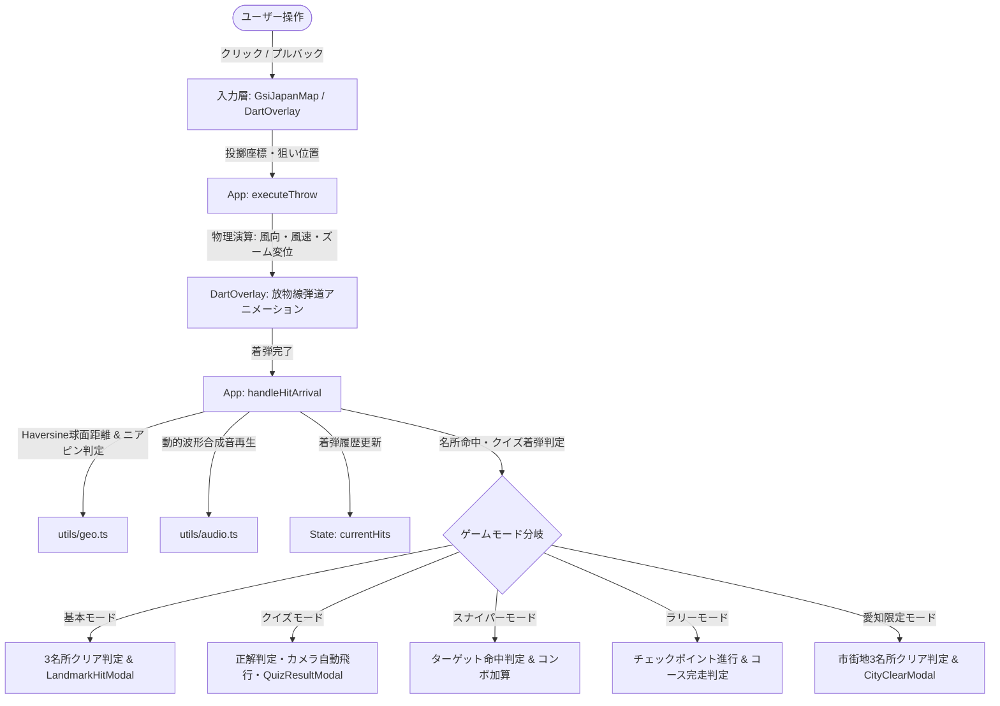

# 日本列島 ダーツの旅 (Japan Dart Trip) システム仕様書

**文書バージョン**: 1.4.0  
**改訂日**: 2026年9月23日  
**対象システム**: 日本列島 ダーツの旅 Webアプリケーション

---

## 目次

1. [システム概要](#1-システム概要)
2. [システムアーキテクチャ・ディレクトリ構成](#2-システムアーキテクチャディレクトリ構成)
3. [データモデル仕様](#3-データモデル仕様)
4. [有名度3段階難易度連動選出システム](#4-有名度3段階難易度連動選出システム)
5. [ゲームモード仕様](#5-ゲームモード仕様)
   - 5.1 [基本モード (名所ニアピン巡り・20候補3選)](#51-基本モード-名所ニアピン巡り20候補3選)
   - 5.2 [ご当地クイズ推理モード (全47都道府県80問)](#52-ご当地クイズ推理モード-全47都道府県80問)
   - 5.3 [スナイパーモード (全国ランダム名所スナイプ)](#53-スナイパーモード-全国ランダム名所スナイプ)
   - 5.4 [ラリーモード (テーマ別名所ツーリング)](#54-ラリーモード-テーマ別名所ツーリング)
   - 5.5 [愛知県詳細限定版 (全38市深掘りモード)](#55-愛知県詳細限定版-全38市深掘りモード)
   - 5.6 [自由探索モード](#56-自由探索モード)
6. [物理エンジン・ゲーム力学仕様](#6-物理エンジンゲーム力学仕様)
7. [UI/UX・アクセシビリティ仕様](#7-uiuxアクセシビリティ仕様)
   - 7.1 [デザイン言語](#71-デザイン言語)
   - 7.2 [フォントサイズ調整仕様](#72-フォントサイズ調整仕様上限300--ctrlホイール対応)
   - 7.3 [名所命中通知フローティングカード & リッチ観光情報UI仕様](#73-名所命中通知フローティングカード--リッチ観光情報ui仕様-landmarkhitmodaltsx)
   - 7.4 [都道府県詳細モーダル & ミッションバーへの情報連携](#74-都道府県詳細モーダル--ミッションバーへの情報連携)
8. [音響・演出仕様](#8-音響演出仕様)
9. [データ永続化・セキュリティ仕様](#9-データ永続化セキュリティ仕様)
10. [品質保証・テスト仕様](#10-品質保証テスト仕様)

---

## 1. システム概要

### 1.1 システムの目的・コンセプト
『日本列島 ダーツの旅』は、日本全国47都道府県および**全国940箇所の厳選観光名所・史跡・絶景**を舞台に、地理知識・精密な狙撃力・風の読みを融合させた和風モダン・ブラウザ地理ダーツゲームです。
国土地理院の公式タイル地図およびスタイライズドSVG地図のデュアルマップエンジンを搭載し、教育的価値とアーケードライクなゲーム体験を極めて高いレベルで両立しています。

### 1.2 動作環境
- **対応プラットフォーム**: Webブラウザ（PC / タブレット / スマートフォン）
- **推奨解像度**: 1280×720 以上（レスポンシブ対応、モバイル縦・横画面対応）
- **推奨ブラウザ**: Google Chrome, Microsoft Edge, Safari, Firefox（最新版）
- **ネットワーク環境**: オンライン（地理院地図タイルおよび名所写真取得）、オフライン耐性（フォールバックSVGおよびSVG地図完備）

### 1.3 技術スタック
| 分類 | 技術・ライブラリ | バージョン / 用途 |
| :--- | :--- | :--- |
| **フロントエンドUI** | React | 19.3.0 (関数コンポーネント, Hooks, StrictMode) |
| **言語** | TypeScript | 6.0.2 (厳格な型安全性の担保) |
| **ビルドツール** | Vite | 8.3.0 (高効率HMR, Rolldownバンドル) |
| **スタイリング** | Tailwind CSS | 3.4.19 (和風グラスモーフィズム, アニメーション) |
| **アイコン** | Lucide React | 1.47.0 (ベクターUIアイコン) |
| **地図エンジン** | Leaflet | 1.9.4 (国土地理院タイル連動, スムーズズーム) |
| **祝賀演出** | Canvas-Confetti | 1.9.4 (多色紙吹雪パーティクル) |
| **音響** | Web Audio API | 外部音声ファイル不要の純粋コード波形シンセサイズ |

---

## 2. システムアーキテクチャ・ディレクトリ構成

### 2.1 ディレクトリ構成
```text
mapDirts/
├── docs/
│   └── SYSTEM_SPECIFICATION.md    # システム仕様書 (本書)
├── src/
│   ├── components/                # UIコンポーネント群
│   │   ├── BasicTourMissionBar.tsx # 基本モードミッション進行バー (有名度バッジ・20候補選出)
│   │   ├── CategoryIcon.tsx       # 名所種類別オリジナルベクターSVGアイコン
│   │   ├── DartOverlay.tsx        # ダーツ投擲弾道・着弾ピン・エフェクト描画
│   │   ├── GameHUD.tsx            # 上部ヘッダー情報・モード切替・風況・難易度・文字サイズ
│   │   ├── GameOverModal.tsx      # スナイパーモード結果発表モーダル
│   │   ├── GsiJapanMap.tsx        # 国土地理院マップエンジン (Leaflet)
│   │   ├── HelpModal.tsx          # 遊び方・操作ガイドモーダル
│   │   ├── JapanMap.tsx           # スタイライズドSVGマップエンジン
│   │   ├── LandmarkHitModal.tsx   # 名所ニアピン命中時フローティング画像カード
│   │   ├── PassportModal.tsx      # 御朱印帳風パスポート・実績手帳モーダル
│   │   ├── PrefectureClearModal.tsx # 都道府県3大名所制覇モーダル
│   │   ├── PrefectureModal.tsx    # 都道府県トリビア・詳細情報モーダル
│   │   ├── QuizGameOverModal.tsx  # クイズ5問終了時リザルト・称号授与モーダル
│   │   ├── QuizQuestionBar.tsx    # クイズ下部出題・3段階ヒント・倍率パネル
│   │   ├── QuizResultModal.tsx    # クイズ投擲後正解地カメラ飛行＆詳細解説モーダル
│   │   ├── RallyCourseModal.tsx   # ラリーコース選択モーダル
│   │   ├── RallyGameOverModal.tsx # ラリー完走リザルトモーダル
│   │   ├── RallyStatusBar.tsx     # ラリー進捗ステータスバー
│   │   ├── AichiMissionBar.tsx    # 愛知限定モード用ミッション進行バー
│   │   ├── AichiCitySelectModal.tsx # 愛知38市選択＆クリア解除モーダル
│   │   └── CityClearModal.tsx     # 市完全制覇・金鯱祝賀モーダル
│   ├── data/
│   │   ├── aichiData.ts           # 愛知県全38市マスターデータ (全38市×3名所＝計114名所)
│   │   ├── landmarksData.ts       # 全国940箇所名所マスターデータ (47都道府県×各20箇所)
│   │   ├── prefectures.ts         # 47都道府県マスターデータ (県庁, 座標, トリビア)
│   │   └── quizData.ts            # 全47都道府県網羅・全80問ご当地推理クイズマスター
│   ├── utils/
│   │   ├── audio.ts               # Web Audio API 音響シンセサイザー & 和風BGM
│   │   ├── geo.ts                 # Haversine球面距離, 方位角, ニアピン判定
│   │   ├── landmarkImages.ts      # 名所画像URLマッピング & フォールバック
│   │   ├── storage.ts             # LocalStorage暗号署名永続化管理
│   │   └── zoomRisk.ts            # ズーム連動リスク＆リターン・風変位係数
│   ├── App.tsx                    # メインオーケストレーターコンポーネント
│   ├── main.tsx                   # エントリーポイント
│   ├── rallyData.ts               # ラリー8大コース定義
│   └── types.ts                   # 全システム共通TypeScript型定義
├── scratch/                       # テスト・検証用スクリプト群
└── package.json                   # 依存関係定義
```

### 2.2 データフロー図


---

## 3. データモデル仕様

### 3.1 都道府県 (`Prefecture`)
```typescript
export interface Prefecture {
  id: number;              // 都道府県コード (1: 北海道 〜 47: 沖縄県)
  name: string;            // 都道府県名 (例: "東京都", "京都府")
  shortName: string;       // 略称 (例: "東京", "京都")
  capital: string;         // 県庁所在地
  region: Region;          // 地方区分 (hokkaido, tohoku, kanto, chubu, kinki, chugoku, shikoku, kyushu_okinawa)
  coordinates: {
    lat: number;           // 県庁実測緯度
    lng: number;           // 県庁実測経度
  };
  svgPath?: string;        // スタイライズドマップ用SVGパス
  mapCenter?: [number, number];
  color?: string;
}
```

### 3.2 名所・ランドマーク (`Landmark`)
全47都道府県 × 各20箇所 ＝ **全国計940箇所の完全データ**（重複IDゼロ・同一県内の名所名重複完全ゼロ・日本国内座標完全検証済み）を保有。
全国すべての名所に対して、有名度3段階分類に加え、旅情を深める「名物グルメ（郷土料理）」および「歴史・観光エピソード（深掘り豆知識）」が完全装備されています。また、あぶくま洞、日光江戸村、成田国際空港展望、三陸鉄道、鞆の浦対潮楼など、全国各地の魅力的な実在名所を100%ユニークに網羅しています。

```typescript
export type LandmarkFameLevel = 'national' | 'regional' | 'minor';

export interface Landmark {
  id: string;                   // 一意キー (例: "tokyo_tower", "kyoto_kinkakuji")
  name: string;                 // 名所名称 (例: "東京タワー")
  prefId: number;               // 所属都道府県ID (1〜47)
  description: string;          // 観光解説・概要 (日本語)
  coordinates: {
    lat: number;                // 実測緯度
    lng: number;                // 実測経度
  };
  mapOffset?: [number, number]; // SVGマップ用描画オフセット
  category: LandmarkCategory;   // 8大種類 + 互換2種
  fameLevel?: LandmarkFameLevel;// 有名度レベル (national / regional / minor)
  imageUrl?: string;            // 名所の高解像度観光写真URL
  localGourmet?: string;        // ご当地名物グルメ・郷土の味 (例: "江戸前握り寿司・月島もんじゃ焼き・深川めし")
  episode?: string;             // 歴史的背景・観光エピソード・深掘り豆知識
}
```

#### リッチ観光メタデータ仕様
1. **ご当地名物グルメ (`localGourmet`)**:
   - 各都道府県および各名所エリアを代表する郷土料理・伝統食・ご当地B級グルメを凝縮して定義（全940名所完全付与）。
   - 命中通知カード（`LandmarkHitModal`）、都道府県詳細モーダル（`PrefectureModal`）、基本モードミッションバー（`BasicTourMissionBar`）の各UIに自動連携表示。
2. **歴史・観光エピソード (`episode`)**:
   - 竣工年・築城の経緯・文化的意義・知られざるトリビアなど、プレイヤーの知的好奇心を刺激する深掘りテキストを収録。
   - 命中時にスライドインするカードに「📜 歴史・観光エピソード」として強調表示。
3. **高解像度観光写真 (`imageUrl` / `LANDMARK_SPECIFIC_IMAGES`)**:
   - 東京タワー、五稜郭、美瑛青い池、松島、日光東照宮、草津温泉、浅草寺、兼六園、松本城、清水寺、姫路城、道後温泉、首里城など、全国主要名所（約40箇所）の実写高精細写真URLを配備。
   - カテゴリー別高品位ローカル画像（`category_*.jpg`）へのシームレスな多重フォールバック構造により、ネットワーク切断時やオフライン環境でも破綻しない堅牢性を確保。

#### 名所種類（10カテゴリー）とオリジナル画像アイコン
OS標準絵文字への依存を完全撤廃し、和モダン調の高精細ベクターSVG画像アイコン（`public/assets/icons/cat_*.svg`）および専用コンポーネント（`CategoryIcon.tsx`）を設計・配備。
1. **城郭・名城 (`castle`)**: 瓦屋根・破風・金鯱の端正な天守閣（金色・黒漆）
2. **寺社仏閣 (`shrine_temple`)**: 朱塗りの明神鳥居と社殿・注連縄（朱色・真紅）
3. **自然・絶景 (`nature`)**: 霊峰富士と旭日・たなびく雲海（翠色・空色）
4. **名湯・温泉 (`hotspring`)**: 立ち上る三本湯気と檜湯桶（紅薔薇・温もり）
5. **美味・食文化 (`gourmet`)**: 湯気立つ漆塗りどんぶりと箸・食材（橙色・黄金）
6. **歴史・世界遺産 (`heritage`)**: 伝統の絵巻物・古代勾玉・墨書（黄土・琥珀）
7. **近代名所・展望 (`modern_spot`)**: 電波タワー・展望デッキと光芒（碧空・シアン）
8. **名園・景勝地 (`garden`)**: 満開の桜花・太鼓橋・枯山水（桜色・桃色）
9. **伝統・文化 (`culture`)**: 雅な和扇子・流水金彩（藤色・藍色）
10. **観光名所 (`spot`)**: 菊花紋様・八角羅針盤ピン（瑠璃色・青色）

### 3.3 ご当地推理クイズデータ (`GeoQuizQuestion`)
全国47都道府県すべてを完全網羅した**全80問**のマスターデータ（`src/data/quizData.ts`）。
```typescript
export interface GeoQuizQuestion {
  id: string;                   // クイズID (例: "quiz_goryokaku", "quiz_hitachi")
  landmarkId: string;           // 正解となる実在の名所ID (LANDMARKSと完全連動)
  prefId: number;               // 所属都道府県ID (1〜47)
  category: LandmarkCategory;   // 名所カテゴリー
  title: string;                // 問題見出し (例: "星形の稜堡と箱館戦争の終焉地")
  prompt: string;               // 出題クイズ本文 (歴史・情景・地理の描写)
  hints: [string, string, string]; // 難易度別3段階ヒント
  explanation: string;          // 正解時に表示される詳細な歴史・観光解説
}
```

### 3.4 着弾データ (`DartHit`)
```typescript
export interface DartHit {
  id: string;              // 一意ID
  x: number;               // ローカルX
  y: number;               // ローカルY
  screenX: number;         // 画面表示X
  screenY: number;         // 画面表示Y
  lat?: number;            // 最終着弾緯度
  lng?: number;            // 最終着弾経度
  prefecture: Prefecture | null;
  targetPrefecture?: Prefecture | null;
  hitLandmark?: Landmark | null; // ニアピン命中した名所
  timestamp: number;
  score: number;           // 獲得得点
  isCorrect?: boolean;     // 目標合致フラグ
  isNearPin?: boolean;     // 名所ニアピンフラグ
  isPinpointBull?: boolean;// 敷地直撃フラグ
  isOb?: boolean;          // 高ズーム枠外OBフラグ
  zoomLevel?: number;      // 投擲時のズームレベル
  zoomMultiplier?: number; // ズーム倍率
  distanceToTargetKm?: number; // 目標名所までの直線距離 (km)
  targetBearing?: string;  // 目標への方角 ("北東", "南西" 等)
  nearestLandmarkName?: string;
  aimLat?: number;         // 狙った緯度 (風流される前の投擲位置)
  aimLng?: number;         // 狙った経度
}
```

---

## 4. 有名度3段階難易度連動選出システム

各都道府県の20箇所（全国940箇所）の名所には、それぞれ有名度レベル（`fameLevel`）が設定されており、ゲームの難易度（`GameDifficulty`）と連動して出現候補プールが切り替わります。

### 4.1 有名度（`LandmarkFameLevel`）の定義と構成比
- **🌟 全国レベル (`national`)**（全国計396箇所・各県平均8.4箇所）:
  誰もが知る超有名名所・日本を代表する国宝や世界遺産（例: 富士山、五稜郭、松島、金閣寺、原爆ドーム、首里城）。
- **🗺️ 地域レベル (`regional`)**（全国計428箇所・各県平均9.1箇所）:
  その地方や県内では定番の名所・景勝地（例: 鳴子峡、角館、大洗磯前神社、清津峡、三段壁、出島）。
- **🌿 マイナー・穴場 (`minor`)**（全国計116箇所・各県平均2.5箇所）:
  知る人ぞ知る秘境・ディープスポット（例: 恐山、仏ヶ浦、龍泉洞、祖谷のかずら橋、神代桜）。

### 4.2 難易度連動選出ルール
```typescript
export function filterLandmarksByDifficulty(
  landmarks: Landmark[],
  difficulty: GameDifficulty = 'easy'
): Landmark[] {
  if (difficulty === 'easy') {
    const nationals = landmarks.filter((lm) => lm.fameLevel === 'national');
    return nationals.length >= 3 ? nationals : landmarks.filter((lm) => lm.fameLevel !== 'minor');
  }
  if (difficulty === 'normal') {
    return landmarks.filter((lm) => lm.fameLevel === 'national' || lm.fameLevel === 'regional');
  }
  return landmarks; // hard: 全20箇所
}
```

| 難易度 | 選出対象名所プール | 1県あたりの候補数 | 目標表示 | ニアピン判定基準 | 投擲後フィードバック |
| :--- | :--- | :---: | :---: | :---: | :--- |
| **Easy** | **全国レベル (`national`) のみ** | 約8〜10箇所 | **常時ON** (ピン表示) | **20.0km** 以内 | 距離・方角・目標ピン |
| **Normal** | **全国 ＋ 地域レベル (`national` + `regional`)** | 約17〜18箇所 | **OFF** (非表示) | **10.0km** 以内 | 直線距離および16方位方角 |
| **Hard** | **すべて (`national` + `regional` + `minor`)** | **全20箇所** | **OFF** (非表示) | **5.0km** 以内 | なし (純粋な地理知識のみ) |

### 4.3 同一名所重複防止ガード & リロール直前除外仕様
- **名所名（`name`）ベースの厳格な一意性ガード**:
  - `getRandomLandmarksForPrefecture` において、Fisher-Yatesシャッフル後に名所名（`name`）をキーとした `Set` による一意性フィルタリングを実行。万が一の表記揺れや類似データがあっても、3箇所の目標の中に同一の名所が2重に選ばれることを100%防止。
- **リロール（名所チェンジ）時の直前名所除外 (`excludeIds`)**:
  - 「🎲 名所チェンジ」または難易度変更時、直前に選ばれていた3箇所の名所ID配列を `excludeIds` として選出関数に伝達。候補数が十分にある限り、直前の名所を完全に除外した新しい名所が優先選出され、「リロールしたのにさっきと同じ名所が出る」ストレスを完全に排除。

### 4.4 リアルタイム再選出連携
- プレイヤーがHUD上の難易度ボタン（Easy / Normal / Hard）を切り替えた際、基本モードで挑戦中の都道府県の名所3箇所が、新しい難易度に応じたプールから**即座に公平再抽選（Fisher-Yatesシャッフル・直前名所除外）**されて画面に反映されます。
- ミッションバー上には難易度に応じた候補プールバッジ（例: `全国レベル候補から3箇所選出`）が表示され、各名所カードには有名度バッジ（`🌟全国` / `🗺️地域` / `🌿穴場`）が美しくレンダリングされます。

---

## 5. ゲームモード仕様

### 5.1 基本モード (名所ニアピン巡り・20候補3選)
本システムの基幹となるメインゲームモード。47都道府県を巡り、各県に設定された3箇所の名所を射抜いて全国制覇を目指します。
- **目標選出仕様**:
  - 各都道府県に登録された**全20箇所の候補**の中から、難易度（Easy/Normal/Hard）に応じた有名度プールに基づき**ランダムに3箇所を公平選出**。
  - ミッションバーの「🎲 名所チェンジ」ボタンをクリックすることで、いつでも同プール内の別の3箇所へ引き直しが可能。
- **名所命中時ノンブロッキング通知 (`LandmarkHitModal`)**:
  - ニアピン命中時、全画面操作を遮断せず、画面右上にスタイリッシュな和風フローティングカードがスライドイン表示。
  - 写真、名所名、所在地、カテゴリー、解説、獲得スコアを約3.8秒間表示後、自動フェードアウト（次の投擲開始でも即時消去）。
- **都道府県切り替え時の完全リセット**:
  - 「別の県」「次の県」への遷移時、過去の県の着弾ピン・履歴およびクリアメッセージを100%確実に消去（`activeHit` 安全ガード搭載）。
- **制覇演出 (`PrefectureClearModal`)**:
  - 3箇所すべてに命中すると、和風の来訪印（「〇〇県 完歩之印」）スタンプと紙吹雪による盛大な祝賀画面を表示。

### 5.2 ご当地クイズ推理モード (全47都道府県80問)
日本全国の地理・歴史・名物に関する知識と精密射撃を融合させた、教養・知性派ゲームモード。
- **ゲーム概要**:
  - 全国47都道府県を完全網羅した**全80問のご当地推理クイズマスターデータ**（`src/data/quizData.ts`）から、1セッションにつき**ランダムに5問**出題。
  - 地図上には目標ピンや名所名が**一切表示されず**、提示されるヒントクイズを手がかりにプレイヤー自身が日本全国マップを探索・推理してダーツを投擲。
- **3段階ヒント & スコア倍率システム**:
  - **ヒント①【歴史・構造・逸話】(初期解放)**: 獲得スコア **3.0x**（難問・ハイリターン）
  - **ヒント②【立地・地理・交通】**: 獲得スコア **2.0x**（地域や山・川、アクセス情報）
  - **ヒント③【決定打・近隣・キーワード】**: 獲得スコア **1.2x**（市区町村名や駅名、最寄りスポット）
  - ヒントを解放せずに正解するほど高倍率のボーナスを獲得。
- **着弾判定 & スコア計算**:
  - **🎯 神の眼直撃 (誤差 1.5km 以内)**: 基本点 3,000pt × ヒント倍率 × ズーム倍率（クリティカル命中音 + 称号フラグ）
  - **⭕ 正解 (誤差 15km 以内)**: 基本点 1,500pt × ヒント倍率 × ズーム倍率（成功ファンファーレ）
  - **⚠️ ニアミス (誤差 40km 以内)**: 500pt（「惜しい！近隣まで推理できています」）
  - **❌ 外れ (誤差 40km 超)**: 0pt（「残念！正解地点は別の場所でした」）
- **学習サポート演出 (自動カメラ飛行 & 解説)**:
  - 投擲後、正解・不正解にかかわらず正解名所の正確な緯度経度へカメラが自動飛行（`flyToLatLng`）。
  - 写真・所在地・誤差距離とともに詳細な歴史エピソードや豆知識を解説するモーダル（`QuizResultModal`）が開き、楽しみながら日本の地理・歴史を学ぶことが可能。
- **総合リザルト & 称号システム (`QuizGameOverModal`)**:
  - 5問終了後、正解率・総得点・全問の振り返りリスト（誤差・判定・獲得スコア）を提示。
  - 成績に応じて4大称号を付与：
    - **Sランク【🗾 日本地理神】**: 5問全問正解 かつ 12,000pt以上
    - **Aランク【🌟 旅の達人】**: 4問以上正解
    - **Bランク【🎒 一人前の旅人】**: 2〜3問正解
    - **Cランク【🌱 見習い旅人】**: 0〜1問正解

### 5.3 スナイパーモード (全国ランダム名所スナイプ)
- **ゲーム概要**: 全国47都道府県・計940箇所の名所の中から、ランダムに指定される1つの名所を制限投数10投の中で次々と狙い撃つ高難度モード。
- **選出仕様**:
  - 全940名所から `getRandomNationalLandmark()` により公平に1名所を即時抽選。
  - HUD上部に「🎯 SNIPER TARGET: 【名所名】 (都道府県名)」および名所の解説・所在県を筆文字で大々的に表示。
- **判定条件**:
  - 難易度に応じたニアピン判定（Hard: 5km以内, Normal: 10km以内, Easy: 20km以内）。
  - ピンポイント直撃（Hard 1.0km / Normal 2.0km / Easy 3.0km以内）でボーナス得点。
- **命中演出 & 進行**:
  - 連続命中によるコンボ倍率（最大3.0x）、ズーム倍率（最大5.0x）、難易度倍率（Hard 1.8x）が重複乗算。10投終了時に総合ランク（S〜C）を判定。

### 5.4 ラリーモード (テーマ別名所ツーリング)
日本の文化・自然・交通・グルメのテーマに沿った実在の名所を、ダーツで順番に走破していく本格ツーリングモード。
- **8大ラリーコース仕様**:
  1. **東海道・山陽新幹線 名所ラリー** (11名所走破 / 初級)
  2. **日本の世界遺産名所めぐり** (8名所走破 / 中級)
  3. **天下の絶品グルメ名所街道** (7名所走破 / 中級)
  4. **日本列島大縦断 7大名所関門** (7名所走破 / 上級)
  5. **日本列島 秘湯・名湯めぐり** (6名所走破 / 初級)
  6. **国宝五城・名城覇王ラリー** (6名所走破 / 中級)
  7. **日本三名園・天下の名園周遊** (6名所走破 / 初級)
  8. **みちのく奥の細道・東北探訪** (5名所走破 / 中級)
- **進行 & 完走仕様**:
  - 各チェックポイントの名所にニアピン命中で名所画像モーダル（`LandmarkHitModal`）が表示され、次の名所へステップ進行。最終名所を射抜くとトロフィー演出付きの完走リザルト画面（`RallyGameOverModal`）で表彰。

### 5.5 愛知県詳細限定版 (全38市深掘りモード)
日本列島の中心に位置する愛知県の全38市を完全に網羅した地域深掘り型ゲームモード。
- **全38市・4大地域区分**:
  - 尾張・名古屋地域 (19市)、知多地域 (5市)、西三河地域 (9市)、東三河地域 (5市)。
- **各市3名所（計114名所）**:
  - 市を選択すると、国土地理院マップが自動でその市中心および推奨ズームレベル（Zoom 11〜13）へ滑らかにカメラ飛行。
- **市選択時のクリアフラグ完全解除・リセット仕様**:
  - 市選択モーダル（`AichiCitySelectModal`）や切り替え時、過去に選んでいた市および新しく選んだ市のクリアフラグ（市制覇・名所クリア）を**自動解除**。
  - 常に未クリア（0/3）から新鮮に挑戦を開始可能。直前の着弾ピン・履歴およびフィードバックも完全消去。
  - 市内の3名所すべてに命中すると、金の鯱（しゃちほこ）アイコンと紙吹雪による豪華な祝福モーダル（`CityClearModal`）が発動。

### 5.6 自由探索モード
制約のないフリー投擲モード。日本列島の任意の場所に着弾させ、その土地の都道府県情報・特産品・豆知識を閲覧可能。

---

## 6. 物理エンジン・ゲーム力学仕様

### 6.1 投擲操作システム
1. **クリック投擲**:
   - 地図上の狙いたい地点を直接タップ/クリックして投擲。
2. **プルバックランチャー (引いて放つ)**:
   - 画面下部の弓矢・ダーツアイコンからドラッグ（引く）して方向と力を溜め、指を離すことで放物線を描いて射出。

### 6.2 風力・風向システム
- **風況変化**: 9秒ごとにランダムで8方位（北、北東、東、南東、南、南西、西、北西）および風速（0.5〜12.0 m/s）が動的に変化。
- **風ドリフト計算**:
  $$\text{driftX} = \text{wind.dx} \times \text{wind.speed} \times \text{driftFactor}$$
  $$\text{driftY} = \text{wind.dy} \times \text{wind.speed} \times \text{driftFactor}$$
  ズームするほど画面上のピクセル単位の変位係数（`driftFactor`）が増大し、精密射撃における風の読みが重要になります。

### 6.3 ズーム連動ハイリスク・ハイリターン仕様
| ズーム階層 | 地図スケール | 得点倍率 | リスクレベル | driftFactor | ニアピン半径 | ピンポイント半径 | OB判定 |
| :--- | :--- | :---: | :---: | :---: | :---: | :---: | :---: |
| **日本全図** | 広域 (Zoom 5〜6.5) | 1.0x | 安全 (Safe) | 0.8 | 60px | 20px | なし |
| **地方広域** | 地方 (Zoom 6.6〜8.5) | 1.8x | 低リスク (Low) | 2.0 | 52px | 22px | なし |
| **都市市街** | 都市 (Zoom 8.6〜11.5) | 2.8x | 中難度 (Medium) | 4.2 | 45px | 24px | なし |
| **市区町村** | 街・駅 (Zoom 11.6〜14.2)| 4.0x | 高倍率 (High) | 7.0 | 38px | 26px | 敷地外流されOB |
| **極限敷地** | ピンポイント (14.3〜) | 5.0x | 極限 (Extreme) | 10.5 | 32px | 28px | 敷地外流されOB |

---

## 7. UI/UX・アクセシビリティ仕様

### 7.1 デザイン言語
- **和風モダン・サイバー**: 深い墨色（`slate-950`）をベースに、金彩（`amber-400`, `amber-500`）、翡翠色（`emerald-400`）、瑠璃色（`sky-400`）のアクセント。
- **グラスモーフィズム**: `glass-panel-gold` による半透明金枠パネルとボケ味（`backdrop-blur-md`）。
- **毛筆フォント**: `font-calligraphy` による和風情緒あるタイポグラフィ。

### 7.2 フォントサイズ調整仕様（上限300% & Ctrl＋ホイール対応）
- **操作仕様**:
  - `Ctrl + マウスホイール上`: フォントサイズを拡大（+5%刻み、最大 **300%**）。
  - `Ctrl + マウスホイール下`: フォントサイズを縮小（-5%刻み、最小 **80%**）。
  - ブラウザ標準ズーム抑止（キャプチャフェーズで `e.preventDefault()` 実行）。
  - HUDワンタップボタン（「Aa」）によるプリセット段階切替。
- **CSS変数スケーリング (`--font-scale`)**:
  - CSS変数 `--font-scale` をルートコンテナに設定し、テキストを滑らかに比例スケーリング。
  - モーダルウィンドウ寸法を `min(95vw, calc(56rem * max(1, --font-scale * 0.75)))` へ動的拡張。
  - `BasicTourMissionBar` および `AichiMissionBar` に「折りたたむ / 展開」トグルボタンを配備。

### 7.3 名所命中通知フローティングカード & 視界確保・スマート操作UI仕様 (`LandmarkHitModal.tsx`)
名所にニアピンまたはピンポイント直撃した瞬間に、画面右側に出現するスマート通知カード。
- **配置とHUDクリアランス仕様**:
  - `top-44 sm:top-48 right-3 sm:right-5` に配置。右上HUD（パスポート、音響、フォント拡大等）のボタン群から100px以上の安全マージンを確保し、操作ボタンや視界への干渉を完全に根絶。
- **ウィンドウサイズの大幅コンパクト化 (高さ約40%削減)**:
  - 横幅を `w-80 sm:w-84`（320〜336px）にスリム化。
  - 写真高さを `h-24 sm:h-28`（96〜112px）に抑制。
  - 全体の高さを従来の約550pxから**約330px（約40%削減）**に凝縮し、マップの広大な視野を維持。
- **➖ 最小化 / ➕ 展開トグルボタン**:
  - ヘッダーバーに最小化トグルを標準配備。クリックすると高さわずか**38pxの極小ピル通知**（「📍 名所名 (都道府県) 詳細を開く」）に瞬時に折りたため、地図上の名所や着弾点を即座に全開確認可能。
- **自由配置ドラッグ移動対応 (Draggable)**:
  - ヘッダー部分をマウスドラッグまたはタッチ操作で掴むことで、画面上の任意の位置へ自由に移動可能（`onPointerDown` / `onPointerMove` / `onPointerUp`）。
- **タイマー制御 & 退出操作の最適化**:
  - 自動消去時間を従来の5.5秒から**3.8秒**に適正化。
  - カードにマウスカーソルをホバーしている間はタイマーおよびプログレスバーを**一時停止**（読みたい時はホバーでじっくり読了可能）。
  - 次のダーツ投擲を開始した瞬間、または✕ボタンクリックで即座にクローズ。

### 7.4 都道府県詳細モーダル & ミッションバーへの情報連携
- **都道府県詳細モーダル (`PrefectureModal.tsx`)**:
  - 各都道府県に属する全20箇所（計940箇所）の名所一覧をスクロール表示（`max-h-64 overflow-y-auto`）。
  - 各名所行にベクターカテゴリSVG、有名度バッジ、名所名、概要に加え、名物グルメ（`🍜 localGourmet`）を表示。
- **基本モードミッション進行バー (`BasicTourMissionBar.tsx`)**:
  - 目標名所カード内に、名所名と概要とともに「🍜」アイコン付きで名物グルメをミニ表示。

---

## 8. 音響・演出仕様

### 8.1 Web Audio API による動的シンセシス (`audio.ts`)
外部音声ファイル不要の純粋コード波形シンセサイズ。
- **投擲音 (`playThrowSound`)**: ホワイトノイズとバンドパスフィルターによる風切り音。
- **通常着弾音 (`playHitSound`)**: サイン波による軽快な着弾打撃音。
- **ピンポイント直撃音 (`playPinpointBullSound`)**: 高音チャイムとファンファーレのハーモニー。
- **OB音 (`playObSound`)**: ノコギリ波による警告ブザー音。
- **ミス音 (`playMissSound`)**: 低周波サイン波によるディップ音。
- **歓声音 (`playCheerSound`)**: フィルタードノイズによる歓声シミュレーション。
- **和風環境BGM (`toggleBGM`)**: ペンタトニック音階（都節音階）による穏やかな琴風アルペジオループ。

---

## 9. データ永続化・セキュリティ仕様

ブラウザの `LocalStorage` を利用し、ゲーム進行状況を安全に自動保存します。全940箇所の名所データや大量の投擲履歴による容量枯渇（5MB制限）を防ぎ、開発者ツールからのスコア改ざんを防御する多層セキュリティ構造を標準装備しています。

### 9.1 保存データ一覧と正規化設計
静的マスターから復元可能な情報（名所名称・解説・座標・画像URL）は一切永続化せず、IDと最小限の統計値のみを記録するスキーマ正規化を徹底しています。

| キー名 | 内部データ型 | 暗号学的保護 | 保存内容 |
| :--- | :--- | :---: | :--- |
| `japan_dart_passport_v1` | `Record<number, PassportRecord>` | 署名エンベロープ | 都道府県別の来訪回数、ハイスコア、制覇フラグ、最終訪問日時 |
| `japan_dart_achievements_v1`| `Achievement[]` | 署名エンベロープ | 獲得済み実績一覧（初投擲、初ニアピン、10県制覇、47県全国制覇等） |
| `japan_dart_basic_cleared_prefs_v1`| `number[]` | 署名エンベロープ | 基本モードで3名所制覇を達成した都道府県IDの配列 |
| `japan_dart_sniper_high_score_v1` | `number` | 署名エンベロープ | スナイパーモードの歴代最高スコア (改ざん検知 & 理論上限チェック) |
| `japan_dart_rally_completions_v1`| `string[]` | 署名エンベロープ | 走破完了したラリーコースIDの配列 |
| `japan_dart_difficulty_v1` | `'easy' \| 'normal' \| 'hard'` | 平文設定値 | プレイヤーが選択した難易度設定 |
| `japan_dart_font_size_v1` | `number` (80〜300) | 平文設定値 | プレイヤーが調整したフォントサイズ倍率 (%) |
| `japan_dart_aichi_cleared_cities_v1`| `string[]` | 署名エンベロープ | 愛知限定モードで制覇した市ID配列 |
| `japan_dart_aichi_cleared_landmarks_v1`| `string[]` | 署名エンベロープ | 愛知限定モードで命中クリアした名所ID配列 |

### 9.2 セキュリティ・改ざん防止仕様 (`SecureStorageEnvelope`)
秘密ソルト（`SECRET_SALT`）とシリアライズされたデータを結合し、チェックサム（FNV-1a / Murmurハイブリッド）を算出。署名のない平文データや改ざんデータを検知した場合、不正な値を即座に破棄して初期値へリセット。

---

## 10. 品質保証・テスト仕様

### 10.1 静的型チェック・ビルド検証
- `npm run build` (`tsc && vite build`) による完全な型検証と本番バンドル整合性の確認（エラー・警告ゼロの担保）。

### 10.2 自動テストスクリプト群
1. **`scratch/verify_fame_level_and_quiz.cjs`**:
   - 47都道府県×各20箇所（計940箇所）の名所マスターデータの完全性（重複IDゼロ、各県厳密に20件、全件fameLevel設定）。
   - 有名度3段階（national: 396件, regional: 428件, minor: 116件）の検証。
   - ご当地推理クイズ全80問（全47都道府県完全網羅）の出題データ整合性（ID一意性、landmarkIdの実在性、ヒント3段階・解説完備の確認）。
2. **`scratch/test_filter_logic.cjs`**:
   - 難易度連動選出ロジック（Easy: nationalのみ、Normal: national+regional、Hard: 全体）の単体テスト検証。
3. **`scratch/verify_difficulty_and_quiz_cdp.cjs`**:
   - Chrome DevTools Protocol (CDP) を用いたヘッドレスブラウザ実機自動操作。
   - 基本モードでのEasy/Normal/Hard切替、難易度連動候補プールバッジ（`全国レベル候補から3箇所選出` 等）の描画、名所カードの有名度バッジ（`🌟全国` / `🗺️地域` / `🌿穴場`）の描画検証。
   - ご当地推理クイズモードへの遷移、出題画面・3段階ヒント・倍率パネルの描画検証。
4. **`scratch/test_features_cdp.cjs` & `scratch/test_aichi_cdp.js`**:
   - ダーツ投擲後の名所命中判定、フローティング画像カードの出現、愛知県全38市選択と自動ズームカメラ移動の検証。
5. **`scratch/verify_rich_landmarks.cjs`**:
   - 全国全940箇所すべての名所に `localGourmet`（名物グルメ）および `episode`（歴史エピソード）が欠落なく1対1で格納されていることの完全性検証。
6. **`scratch/verify_rich_landmarks_cdp.cjs`**:
   - ヘッドレスブラウザ（Edge CDP）による名所命中時フローティングカード（`LandmarkHitModal`）の実機描画検証。
   - 写真・所在地・カテゴリー・有名度バッジ・ご当地名物タグ・歴史エピソード欄・旅の加護・スクロール構造の完全表示およびスクリーンショット自動キャプチャ検証。
7. **`scratch/verify_unique_landmarks.cjs`**:
   - 全国全940箇所の都道府県別名所名の一意性（同一県内重複ゼロ）検証。
   - 各難易度（Easy/Normal/Hard）×全47都道府県×100回シミュレーション（計14,100回選出）における同一名所重複完全ゼロ（0件）の検証。
   - リロール（名所チェンジ）時の直前名所除外率100%（47/47県で直前と異なる名所が選出）の動作検証。
8. **`scratch/verify_hit_modal_improvements_cdp.cjs`**:
   - ヘッドレスブラウザ（Edge CDP）による命中通知カードのHUDボタン分離クリアランス（`top-44`）、コンパクト化、最小化トグル（極小ピル通知化）、水族館固有写真表示の実機自動検証。
